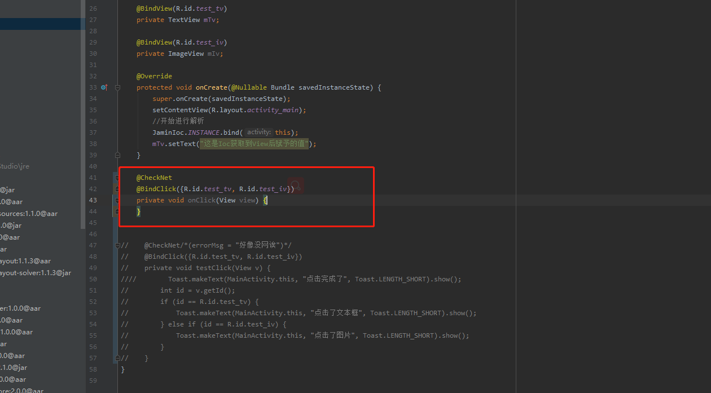

# IOC注解框架插件

## 注意

　　如果使用Idea 编译时请选择JDK的版本,操作如下：

　　File -> Settings -> Build, Execution, Deployment -> Compiler -> Java Compiler

   
   
## 使用方法

　　IOC的核心代码请下载工程，自行引入，[链接在此](https://github.com/EastUp/ConnotationJokes/tree/master/baselibrary/src/main/java/com/east/baselibrary/ioc)

　　plugin中选择本地的插件jar包

   
## 效果图

 

      
     
 

